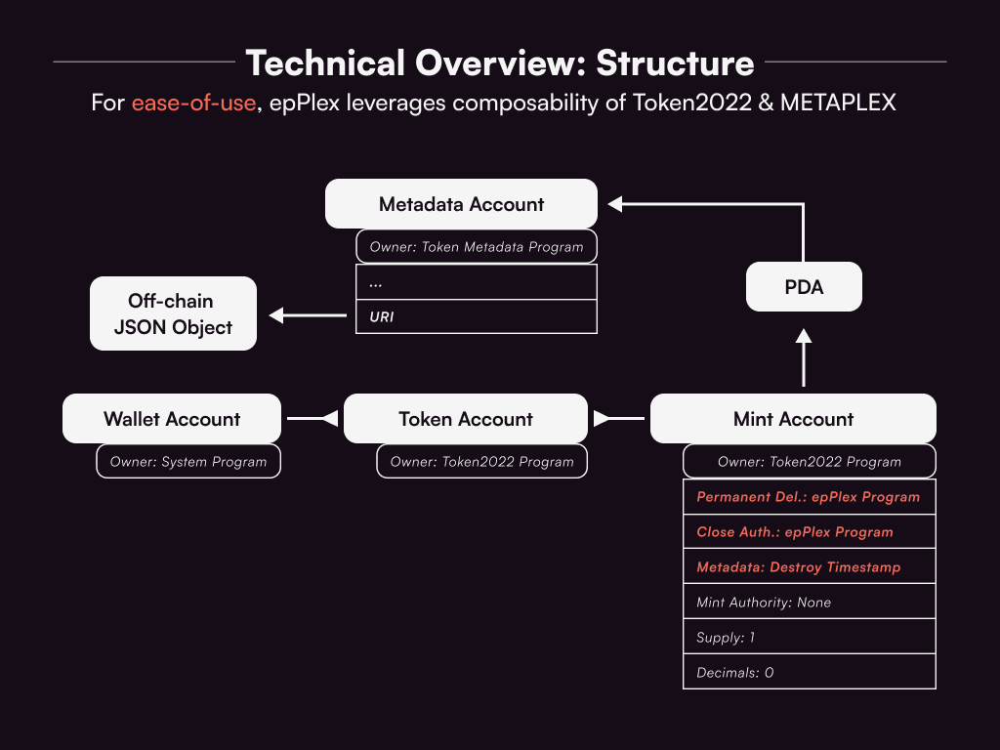

<h1 align="center">epPlex | 1st Prize Hyperdrive Hackathon</h1>

epPlex is a protocol for ephemeral epNFTs.
I.e. NFTs that can self-destruct permissionlessly.

It is an open-source Infrastructure Primitive & Public Good built on top of Token2022 & Metaplex.

Submitted Hyperdrive tracks:
- Public Goods (was not a choice in the submission form)
- Crypto Infrastructure
- Gaming & Entertainment

## Links
[https://epplex.xyz](https://epplex.xyz/)

[Hyperdrive Pitch PDF](https://epplex.xyz/HyperdrivePitch.pdf)

[Pitch Presentation](https://youtu.be/FXaGxVFanDs?si=Tne5biENrXJKjiSY)

## How to use
- The no-code creation UI should be rather straight forward. Example inputs can be found in `app/utils/nftMetadata.txt`.
- Check for epNFTs of any wallet owner by specifying the `owner` query parameter in the URL (connect any wallet first)
  - [https://www.epplex.xyz/demo?owner=38ZEie1B9RFyvLaS1QCb4HjrXowXzgvqALv9JBMhmPxR](https://www.epplex.xyz/demo?owner=38ZEie1B9RFyvLaS1QCb4HjrXowXzgvqALv9JBMhmPxR)

## Use-cases
To illustrate viable businesses I attempted to build AdDrop ([link to repo](https://github.com/epPlex/AdDrop)):
A mobile app for creators to airdrop epNFTs as ads, and for consumers to view, earn & use ads.
Although the idea probably needs to go through a few more idea iterations.

- Services (built-in time restrictions)
  - NFT as subscriptions
  - Access to services
  - Ticketing
  - Coupons
- Social media apps
  - Snapchat-like apps
- Performance art
  - High-brow artwork for ephemeral enjoyment
- Games where
  - Tamagotchi game where NFT self-destructs if not attended to properly
- NFT collections
  - Utilisng hot-potato mechanisms
  - New holder engagement mechanisms
  - DAO-gated access

## How it works

### 1. epNFT representation
An epNFT is currently represented as a Token2022 token with the following extensions
- `Permanent Delegate`
- `CloseAuthority`
- `TokenMetadata` key-value pairs:
    - `DestroyTimestamp`: unixTimestamp
    - `name`: string
    - `symbol`: string
    - `uri`: string

The `uri` field points to the off-chain JSON object with image URL and metadata.

Ideally it would use the MPLX Token Metadata Program for wider ecosystem compatibility

Rumour has it that Token2022 support for MPLX Token Metadata Program is coming end of Oct 2023.

OBS: I need to double check whether or not the supply is actually fixed to 1 and no Mint Authority exists.

### 2. Global Program Delegate
The Program Delegate PDA is assigned elevated privileges through the Token2022 extensions.
This enables the program to destroy epNFTs on behalf of the owner.

### 3. epNFT lifecycle
1. User submits create instruction with TokenMetadata
   - epNFT is created through CPI into Token2022 program
   - Program Delegate is assigned `Permanent Delegate` and `CloseAuthority` privileges
2. Anyone can submit destroy instruction on the epNFT
   - If `current_timestamp <= destroy_timestamp` then fail the tx
   - Otherwise tx succeeds, where the Program Delegate acts as the program-owned authority to burn & close the epNFT.

### 4. Rent collection
Currently, epPlex collects all the epNFT rent-exemption through the Program Delegate.
Although, it can easily be modified to be: instruction invoker collects the rent.

### 5. Bot infrastructure
I currently have not yet implemented any bot infrastructure for destroying epNFTs.
One of the reasons is that this could be offloaded to arbitrageurs (rent farmers). The other reason is lack of time.
It would be cool to have Open-Clockwork power this on-chain.

## Future work
- √ epPlex MVP
- Build SDK for developers
- Bot infrastructure for destroying epNFTs
    - Using Open-Clockwork
- METAPLEX integration
    - Token Metadata Program with Token2022 support is an assumed prerequisite for proper epNFT adoption
        - Token2022 audit should be finished by Q4 2023.
    - NOTE: Currently, Token2022 metadata is used, but it probably takes more time to be adopted by wallets
        - OBS: I need to investigate how wallets index NFTs, whether it is purely based on MPLX Token Metadata Program.
- State-compression for cheaper minting fees
- Event-based ephemerality e.g. self-destruct
    - when BTC reaches $100k
    - after X amount of transfers
    - other programmable logic
- Immutability

## Deployment

| Name            | Networks       | Responsibility               | Address | Link                                                                                                                                                                                                                  |
|-----------------|----------------|------------------------------|---------|-----------------------------------------------------------------------------------------------------------------------------------------------------------------------------------------------------------------------|
| epplex-core     | DEVNET/MAINNET | Main epplex NFT              | `epCoD6BqcNinLvKN3KkY55vk4Kxs3W1JTENs1xqWUTg`     | [DEVNET](https://explorer.solana.com/address/epCoD6BqcNinLvKN3KkY55vk4Kxs3W1JTENs1xqWUTg?cluster=devnet)/[MAINNET](https://explorer.solana.com/address/epCoD6BqcNinLvKN3KkY55vk4Kxs3W1JTENs1xqWUTg?cluster=mainnet) |
| epplex-burger   | DEVNET/MAINNET | For custom NFT logic         | `epBuJysRKuFMMWTWoX6ZKPz5WTZWb98mDqn1emVj84n`     | [DEVNET](https://explorer.solana.com/address/epBuJysRKuFMMWTWoX6ZKPz5WTZWb98mDqn1emVj84n?cluster=devnet)/[MAINNET](https://explorer.solana.com/address/epBuJysRKuFMMWTWoX6ZKPz5WTZWb98mDqn1emVj84n?cluster=mainnet)                                                                                                                                                                                                                   |

## Development

### Setup
1. Clone epplex repo
2. Clone sdk repo
3. Ask Bob for local keypairs
    4. Put program keypairs into `target/deploy`
    5. Put local admin keypair into `.local_keys/epplex_PAYER_ADMIN.json`
        6. pubkey address: `LAdmTEtom7qm3ZmchsrqSkZhPdmZaex7oXCamuMHs9F`
5. Run: `sh start.sh` in a terminal
    4. This starts a local validator
6. Run: `sh start.sh` again in another terminal
    6. This deploys the programs into the local validator
7. Set `.env` in SDK repo to localhost `RPC=http://127.0.0.1:8899`
8. Now your local environment is all set up

### Tech stack
- NextJS Frontend/Backend (hosted on vercel) for demoing purposes
  - Uses Genesysgo SHDW for NFT metadata
- Anchor Framework for epPlex contract

### Folder structure
    ├── app                                 # NextJS Frontend
    ├── programs                            # epPlex Solana program, probably should have moved this into its own repo
    └── scripts                             # Scripts for testing purposes, although I probably should have kept a test-suite

## Disclaimer
The code has not been audited.

